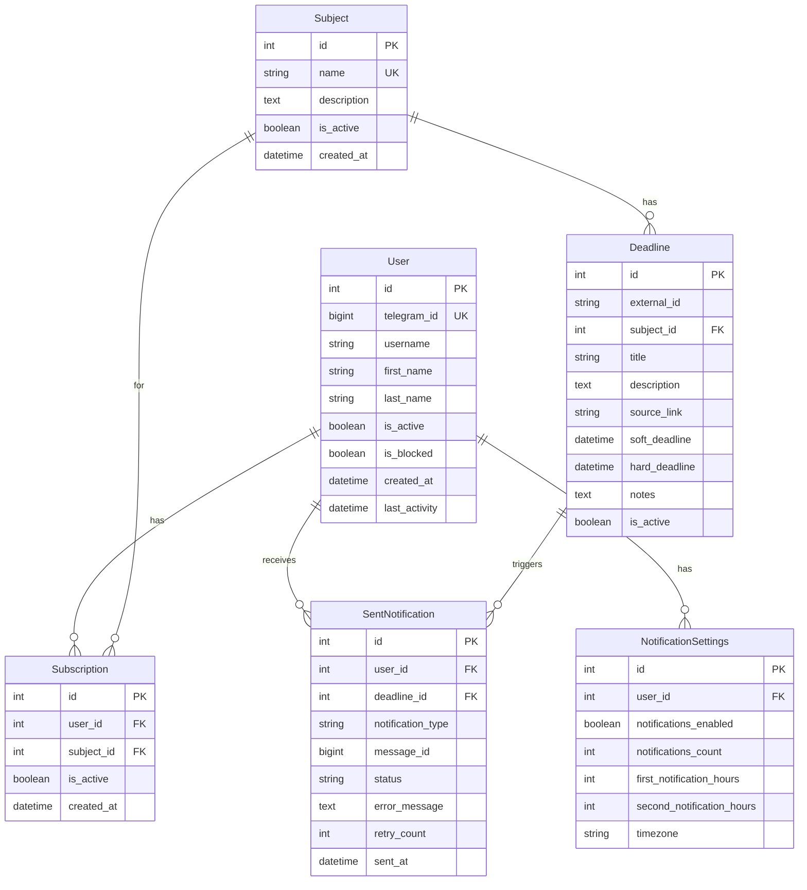

# 🏗️ Архитектура HSE Bot AI Masters

Подробное описание архитектуры телеграм бота для уведомлений о дедлайнах.

## 📊 Общая архитектура

```
┌─────────────────┐    ┌─────────────────┐    ┌─────────────────┐
│   Telegram      │    │   Google        │    │   Users         │
│   Bot API       │◄──►│   Sheets API    │    │   (800+)        │
└─────────────────┘    └─────────────────┘    └─────────────────┘
         │                       │                       │
         ▼                       ▼                       ▼
┌─────────────────────────────────────────────────────────────────┐
│                    HSE Bot Application                          │
├─────────────────────────────────────────────────────────────────┤
│  ┌─────────────┐  ┌─────────────┐  ┌─────────────┐             │
│  │  Handlers   │  │ Middlewares │  │  Services   │             │
│  │             │  │             │  │             │             │
│  │ • Start     │  │ • Logging   │  │ • Notifications │         │
│  │ • Subscribe │  │ • Database  │  │ • Google Sheets │         │
│  │ • Settings  │  │ • Auth      │  │ • Delivery      │         │
│  └─────────────┘  └─────────────┘  └─────────────┘             │
├─────────────────────────────────────────────────────────────────┤
│  ┌─────────────┐  ┌─────────────┐  ┌─────────────┐             │
│  │ Scheduler   │  │    CRUD     │  │   Models    │             │
│  │             │  │             │  │             │             │
│  │ • Sync      │  │ • Users     │  │ • User      │             │
│  │ • Notify    │  │ • Subjects  │  │ • Subject   │             │
│  │ • Cleanup   │  │ • Deadlines │  │ • Deadline  │             │
│  └─────────────┘  └─────────────┘  └─────────────┘             │
└─────────────────────────────────────────────────────────────────┘
         │                       │                       │
         ▼                       ▼                       ▼
┌─────────────────┐    ┌─────────────────┐    ┌─────────────────┐
│   PostgreSQL    │    │     Redis       │    │    Loguru       │
│   Database      │    │     Cache       │    │    Logging      │
└─────────────────┘    └─────────────────┘    └─────────────────┘
```

## 🎯 Принципы архитектуры

### Clean Architecture
- **Разделение слоев**: Handlers → Services → Repositories → Models
- **Dependency Inversion**: Зависимости направлены внутрь
- **Single Responsibility**: Каждый компонент имеет одну ответственность

### Асинхронность
- **Полностью асинхронная архитектура** с использованием asyncio
- **Неблокирующие операции** для всех I/O операций
- **Concurrent обработка** пользователей и уведомлений

### Масштабируемость
- **Горизонтальное масштабирование** через контейнеризацию
- **Батчинг операций** для оптимизации производительности
- **Кеширование** часто используемых данных

## 📦 Компоненты системы

### 1. Handlers Layer (Обработчики)

```python
src/bot/handlers/
├── __init__.py          # Регистрация всех хендлеров
├── start.py            # Команда /start и регистрация
├── help.py             # Команда /help и справка
├── subscriptions.py    # Управление подписками
├── settings.py         # Настройки уведомлений
└── common.py           # Общие хендлеры
```

**Ответственность**:
- Обработка команд пользователей
- Валидация входящих данных
- Формирование ответов пользователю
- Управление состояниями FSM

### 2. Middlewares Layer (Промежуточное ПО)

```python
src/bot/middlewares/
├── __init__.py         # Регистрация middleware
├── logging.py          # Логирование действий
└── database.py         # Управление сессиями БД
```

**Ответственность**:
- Логирование всех действий пользователей
- Управление сессиями базы данных
- Обновление активности пользователей
- Обработка ошибок

### 3. Services Layer (Бизнес-логика)

```python
src/bot/services/
├── __init__.py         # Экспорт сервисов
├── notifications.py    # Логика уведомлений
├── google_sheets.py    # Интеграция с Google Sheets
└── delivery.py         # Надежная доставка сообщений
```

**Ответственность**:
- Бизнес-логика приложения
- Интеграция с внешними API
- Обработка уведомлений
- Retry механизмы

### 4. Data Layer (Данные)

```python
src/db/
├── __init__.py         # Экспорт моделей и CRUD
├── models.py           # SQLAlchemy модели
├── crud.py             # CRUD операции
└── session.py          # Настройка сессий БД
```

**Ответственность**:
- Определение структуры данных
- CRUD операции
- Управление соединениями с БД
- Миграции данных

## 🗄️ Модель данных

### Основные сущности



### Индексы для производительности

```sql
-- Основные индексы для быстрого поиска
CREATE INDEX idx_users_telegram_id ON users(telegram_id);
CREATE INDEX idx_users_active ON users(is_active, is_blocked);
CREATE INDEX idx_subscriptions_user_active ON subscriptions(user_id, is_active);
CREATE INDEX idx_deadlines_hard_deadline ON deadlines(hard_deadline);
CREATE INDEX idx_sent_notifications_user_status ON sent_notifications(user_id, status);
```

## 🔄 Потоки данных

### 1. Поток регистрации пользователя

```
User → /start → StartHandler → UserCRUD.get_or_create() → NotificationSettingsCRUD.get_or_create() → Response
```

### 2. Поток подписки на дисциплину

```
User → /subscribe → SubscriptionHandler → SubjectCRUD.get_all_active() → Display subjects → 
User clicks → SubscriptionCRUD.subscribe() → Response
```

### 3. Поток синхронизации дедлайнов

```
Scheduler → GoogleSheetsClient.get_deadlines() → DeadlineCRUD.upsert_from_sheets() → 
SubjectCRUD.get_or_create() → Database update
```

### 4. Поток отправки уведомлений

```
Scheduler → NotificationService.check_and_send_notifications() → 
DeadlineCRUD.get_upcoming_deadlines() → SubscriptionCRUD.get_subject_subscribers() → 
NotificationService._send_single_notification() → DeliveryService.send_message_with_retry() → 
SentNotificationCRUD.create()
```

## ⚡ Оптимизации производительности

### 1. Батчинг операций

```python
# Отправка уведомлений батчами по 50 сообщений
NOTIFICATION_BATCH_SIZE = 50

# Обработка пользователей группами
for i in range(0, len(users), batch_size):
    batch = users[i:i + batch_size]
    await process_batch(batch)
```

### 2. Connection Pooling

```python
# Пул соединений для PostgreSQL
engine = create_async_engine(
    database_url,
    pool_size=20,
    max_overflow=30,
    pool_timeout=30,
    pool_recycle=3600
)
```

### 3. Кеширование

```python
# Redis для кеширования настроек пользователей
@cache(ttl=1800)  # 30 минут
async def get_user_settings(user_id: int):
    return await NotificationSettingsCRUD.get_by_user_id(session, user_id)
```

### 4. Rate Limiting

```python
# Соблюдение лимитов Telegram API
TELEGRAM_RATE_LIMIT = 25  # сообщений в секунду
rate_limit_delay = 1.0 / TELEGRAM_RATE_LIMIT

await asyncio.sleep(rate_limit_delay)
```

## 🔒 Безопасность

### 1. Валидация данных

```python
# Валидация всех входящих данных
def validate_telegram_id(telegram_id: int) -> bool:
    return isinstance(telegram_id, int) and telegram_id > 0

def validate_notification_hours(hours: int) -> bool:
    return isinstance(hours, int) and 0 < hours <= 168  # Максимум неделя
```

### 2. Rate Limiting для пользователей

```python
# Ограничение частоты команд от пользователей
USER_RATE_LIMIT = 10  # команд в минуту
GLOBAL_RATE_LIMIT = 1000  # команд в минуту для всех пользователей
```

### 3. Безопасное хранение секретов

```python
# Использование переменных окружения для секретов
BOT_TOKEN = os.getenv("BOT_TOKEN")
DATABASE_URL = os.getenv("DATABASE_URL")

# Никогда не логируем секретные данные
logger.info(f"Bot token: {BOT_TOKEN[:10]}...")  # Только первые 10 символов
```

## 📊 Мониторинг и наблюдаемость

### 1. Структурированное логирование

```python
# Использование Loguru для структурированного логирования
logger.info(
    "Notification sent",
    user_id=user_id,
    deadline_id=deadline_id,
    notification_type=notification_type,
    status="sent"
)
```

### 2. Метрики производительности

```python
# Сбор метрик производительности
class PerformanceMonitor:
    def collect_metrics(self):
        return {
            'cpu_percent': psutil.cpu_percent(),
            'memory_mb': psutil.virtual_memory().used / 1024 / 1024,
            'active_users': await UserCRUD.count_active(),
            'pending_notifications': await get_pending_count()
        }
```

### 3. Health Checks

```python
# Проверки состояния системы
async def health_check():
    checks = {
        'database': await db_manager.health_check(),
        'redis': await redis_client.ping(),
        'google_sheets': await sheets_client.health_check(),
        'scheduler': scheduler.running
    }
    return all(checks.values())
```

## 🚀 Развертывание и масштабирование

### 1. Контейнеризация

```dockerfile
# Многоэтапная сборка для оптимизации размера образа
FROM python:3.11-slim as builder
# ... установка зависимостей

FROM python:3.11-slim as runtime
# ... копирование приложения
```

### 2. Горизонтальное масштабирование

```yaml
# Docker Compose для масштабирования
services:
  bot:
    image: hse-bot:latest
    deploy:
      replicas: 3
      resources:
        limits:
          memory: 512M
          cpus: '0.5'
```

### 3. Мониторинг в продакшне

```python
# Автоматические алерты при проблемах
if cpu_usage > 80:
    send_alert("High CPU usage detected")

if memory_usage > 500:  # MB
    send_alert("High memory usage detected")

if db_response_time > 100:  # ms
    send_alert("Slow database response")
```

## 🔮 Будущие улучшения

### 1. Микросервисная архитектура
- Разделение на отдельные сервисы: Bot API, Notification Service, Scheduler
- Использование message queues (RabbitMQ/Apache Kafka)
- Service mesh для межсервисного взаимодействия

### 2. Расширенная аналитика
- Сбор метрик использования
- A/B тестирование уведомлений
- Машинное обучение для оптимизации времени уведомлений

### 3. Дополнительные интеграции
- Интеграция с календарями (Google Calendar, Outlook)
- Поддержка других мессенджеров (Discord, Slack)
- Web-интерфейс для администрирования

### 4. Улучшения производительности
- Использование GraphQL для оптимизации запросов
- Внедрение CQRS паттерна
- Event-driven архитектура